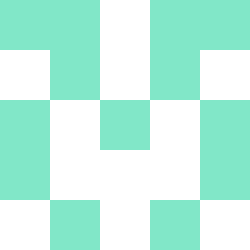

# github_avatar
Имя ковертируется в 16 битный хэш.Из них сделал массив из 16 элементов. Из первых трех элементов сделал цвет 
Фото состоит из 25 квадратов, 15 элементов с массива распложил слева,а напрво поставил его копию.  
Покрасил элемениы с нечетным чиcлом. С помощью draw2dimg конвентируем в png 
 Used hashing: <a href="https://pkg.go.dev/crypto/md5@go1.17.5">crypto/md5</a>
and draw2d  <a href="github.com/llgcode/draw2d">draw2d package</a>  
Package draw2d is a go 2D vector graphics library with support for multiple outputs such as images (draw2d), pdf documents (draw2dpdf), opengl (draw2dgl) and svg (draw2dsvg).

тип этого

